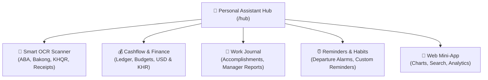
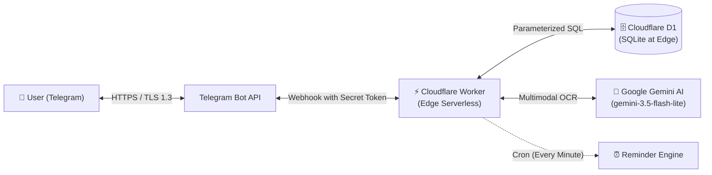

# 🌟 Personal Assistant Bot

<p align="center">
  
  
  
  
  
</p>

An all-in-one, 24/7 personal productivity and organization assistant hosted on **Cloudflare Workers** with **Cloudflare D1**. Built with a serverless edge architecture—consuming **0 MB RAM and 0% CPU when idle** while delivering sub-second response times worldwide.

The bot is structured as an extensible **Personal Assistant Hub (`/hub`)**, organizing your daily workflow into dedicated modules and workspaces.

---

## 🌟 Modular Workspaces



### 1. 🧾 Smart OCR & Receipt Scanner Module
* **Zero-Friction Logging:** Snap or forward any ABA Mobile payment, Bakong KHQR transfer, Acleda slip, or printed store receipt directly into chat.
* **Instant Extraction:** Automatically parses amount, currency (`USD` / `KHR`), merchant name, date, and smart category.
* **Interactive Confirmation:** 1-tap confirmation `[✅ Confirm]`, instant category switcher `[🏷️ Category]`, and `[🔄 Make Income]` toggle.
* **Powered by Gemini AI:** High accuracy with bilingual recognition for English and Khmer script (អក្សរខ្មែរ).

### 2. 💰 Cashflow & Finance Module
* **Dual Currency Support:** Tracks in both USD ($) and Cambodian Riel (៛), with automatic conversion at 1 USD = 4,000 KHR.
* **Natural Text Entry:** Type `5 coffee`, `10000 lunch`, or `+500 salary`—no command syntax required.
* **Itemized Daily Ledger:** Real-time itemized breakdown (`/today` or `today`).
* **Visual Budget Gauges:** Set monthly spending limits (`/budget 300 usd`) with proactive threshold warnings.
* **Data Portability:** 1-click CSV backup export (`/clear`).

### 3. 💼 Work Journal & Manager Reports Module
* **Daily Accomplishment Log:** Record completed tasks instantly with `/done Fixed checkout bug` or `did code review`.
* **One-Click Monthly Reports:** Type `/report` to generate structured, professional accomplishment reports organized by week and category—ready for 1-on-1s or manager performance reviews.
* **Exportable:** Download your complete monthly report as a `.txt` file (`/report export`).

### 4. ⏰ Reminders & Habits Module
* **Departure Alarms:** Weekday reminder (e.g. 5:30 PM) so you never leave your lunch box or belongings behind. Includes `[✅ Got it!]` and `[⏰ Snooze 15m]` buttons.
* **Natural Reminders:** Supports exact and relative times: `remind 17:30 Standup` or `remind in 20m Check oven`.
* **Automated Cron Engine:** Powered by Cloudflare Worker cron triggers running every minute.

### 5. 📱 Interactive Web Mini-App Dashboard
* Built-in Telegram WebApp accessible via `/hub`.
* Interactive spending charts powered by **Chart.js**.
* Historical search, category filtering, and paginated transaction history.

---

## ⚡ Commands & Shortcuts

| Command | Shortcut | Workspace | Description |
| :--- | :--- | :--- | :--- |
| `/hub` | `/menu`, `menu`, `hub` | **Main Hub** | Open Personal Assistant Hub portal |
| `/scan` | `/ocr`, `/receipt` | **Scanner** | Bank slip & receipt scanner guide (or just send a photo) |
| `/finance` | `/f`, `money`, `balance` | **Finance** | Open Cashflow & Finance workspace |
| `/add <amt> <curr> <cat>` | `5 coffee`, `10000 lunch` | **Finance** | Log an expense |
| `/income <amt> <curr>` | `+500 salary` | **Finance** | Log income |
| `/today` | `/t`, `today`, `ledger` | **Finance** | View today's itemized transactions |
| `/summary` | — | **Finance** | Today's spending stats & category progress |
| `/week` | — | **Finance** | 7-day spending report with chart |
| `/month` | — | **Finance** | Current month summary & budget progress |
| `/budget <amt> <curr>` | `/b` | **Finance** | Set monthly spending limit (e.g. `/budget 300 usd`) |
| `/work` | `/w`, `tasks` | **Work** | Open Work Journal workspace |
| `/done <task>` | `did ...`, `finished ...` | **Work** | Log a completed work accomplishment |
| `/report` | `report` | **Work** | Generate this month's manager accomplishment report |
| `/report last` | — | **Work** | Generate last month's accomplishment report |
| `/report export` | — | **Work** | Export accomplishment report as a `.txt` document |
| `/reminders` | `/r` | **Reminders** | Open Reminders & Habits workspace |
| `/remind <time> <title>` | `remind in 15m ...` | **Reminders** | Set custom reminder (24h or relative time) |
| `/lunchbox` | `/lb` | **Reminders** | Lunch box departure reminder manager |
| `/settings` | — | **Settings** | Currency toggle (USD/KHR) & budget configuration |
| `/help` | `/h`, `help` | **Help** | View interactive bot guide |

---

## 🏗️ Architecture & Security



### Security & Privacy Protections
* **Encrypted in Transit & at Rest:** All communications use TLS 1.3. Cloudflare D1 data is encrypted at rest.
* **Webhook Authentication:** Every incoming request verifies the `X-Telegram-Bot-Api-Secret-Token` header. Unauthorized HTTP requests are rejected immediately with `401 Unauthorized`.
* **Zero SQL Injection Risk:** All database queries utilize strictly parameterized bindings (`db.prepare(...).bind(...)`).
* **Secret Isolation:** Credentials (`TELEGRAM_BOT_TOKEN`, `GEMINI_API_KEY`, `WEBHOOK_SECRET`) reside in Cloudflare's encrypted environment storage and are never exposed in code or client responses.
* **Zero Idle Footprint:** Serverless V8 isolates run on-demand in milliseconds when a message arrives and shut down immediately, leaving no persistent processes or open attack surfaces.

---

## 🚀 Setup & Deployment

### Prerequisites
1. **Node.js** (v18 or higher)
2. **Cloudflare Account** (Free tier)
3. **Telegram Bot Token** (from [@BotFather](https://t.me/BotFather))
4. **Google Gemini API Key** (Free key from [Google AI Studio](https://aistudio.google.com/))

### 1. Installation
```bash
git clone https://github.com/<your-username>/personal-assistant-bot.git
cd personal-assistant-bot
npm install
```

### 2. Cloudflare Authentication
```bash
npx wrangler login
```

### 3. Create Cloudflare D1 Database
```bash
npx wrangler d1 create cashflow_bot
```
Copy the returned `database_id` and paste it into your `wrangler.toml`:
```toml
[[d1_databases]]
binding = "DB"
database_name = "cashflow_bot"
database_id = "your-database-id-here"
```

### 4. Run Schema Migrations
```bash
npm run db:migrate:remote
```

### 5. Configure Cloudflare Secrets
Securely store your secrets in Cloudflare:
```bash
npx wrangler secret put TELEGRAM_BOT_TOKEN
npx wrangler secret put WEBHOOK_SECRET
npx wrangler secret put GEMINI_API_KEY
```
> [!TIP]
> `WEBHOOK_SECRET` can be any random string (e.g. generated via `openssl rand -hex 24`). It protects your webhook endpoint against unauthorized traffic.

### 6. Deploy Worker to Cloudflare
```bash
npm run deploy
```
Note your deployment URL (e.g. `https://<worker-name>.<subdomain>.workers.dev`).

### 7. Register the Telegram Webhook
Run the automated webhook registration script:

**On macOS / Linux:**
```bash
export TELEGRAM_BOT_TOKEN="your-bot-token"
export WEBHOOK_SECRET="your-webhook-secret"
export WORKER_URL="https://<worker-name>.<subdomain>.workers.dev"
npm run set:webhook
```

**On Windows (PowerShell):**
```powershell
$env:TELEGRAM_BOT_TOKEN="your-bot-token"
$env:WEBHOOK_SECRET="your-webhook-secret"
$env:WORKER_URL="https://<worker-name>.<subdomain>.workers.dev"
npm run set:webhook
```

---

## 💻 Local Development

1. Create your local environment file:
```bash
cp .dev.vars.example .dev.vars
```
Populate `.dev.vars` with your `TELEGRAM_BOT_TOKEN`, `WEBHOOK_SECRET`, and `GEMINI_API_KEY`.

2. Initialize your local SQLite database:
```bash
npm run db:migrate:local
```

3. Start the local server:
```bash
npm run dev
```

---

## 📊 Free Tier & Cost Breakdown

| Component | Free Tier Allowance | Personal Assistant Bot Usage | Monthly Cost |
| :--- | :--- | :--- | :--- |
| **Cloudflare Workers** | 100,000 requests / day | ~100 – 1,000 requests / day | **$0.00** |
| **Cloudflare D1** | 5M reads + 100k writes / day | ~500 reads + 200 writes / day | **$0.00** |
| **Google Gemini API** | 15 RPM / 1,500 requests / day (Free tier) | ~10 – 50 receipt scans / day | **$0.00** |
| **Telegram Bot API** | Unlimited messages | Standard bot traffic | **$0.00** |

---

## 🛡️ Security Best Practices
- Never commit `.dev.vars` or any file containing API keys into version control.
- If your Telegram bot token is ever exposed, revoke and regenerate it immediately via [@BotFather](https://t.me/BotFather).
- Rotate your `WEBHOOK_SECRET` periodically by updating the Cloudflare secret and re-running `npm run set:webhook`.

